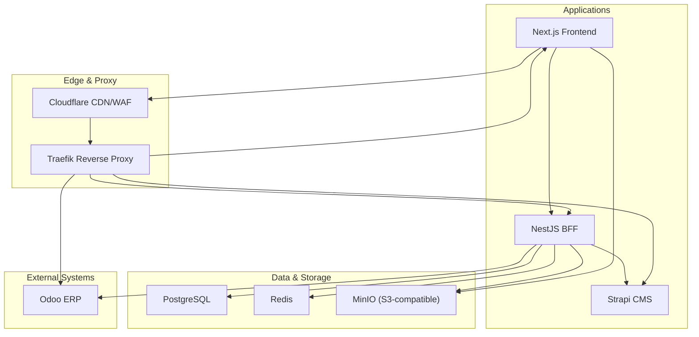
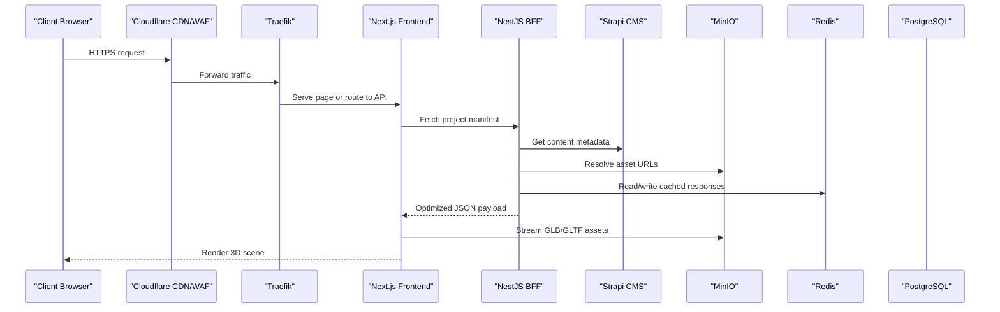
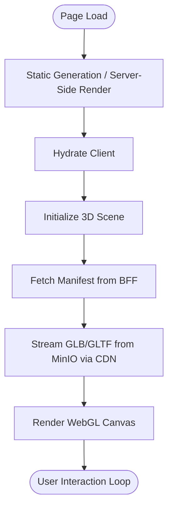
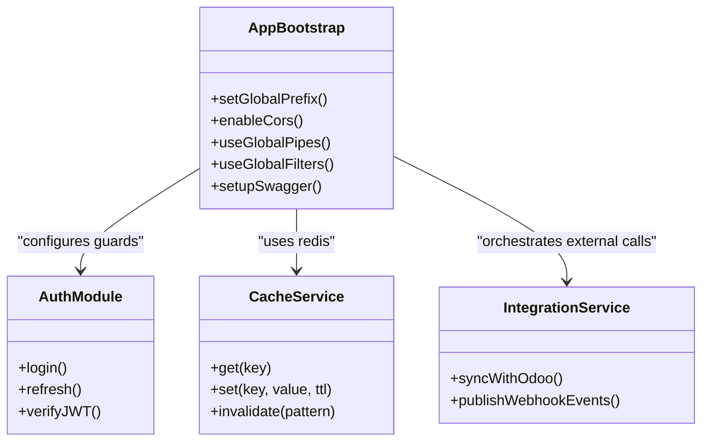
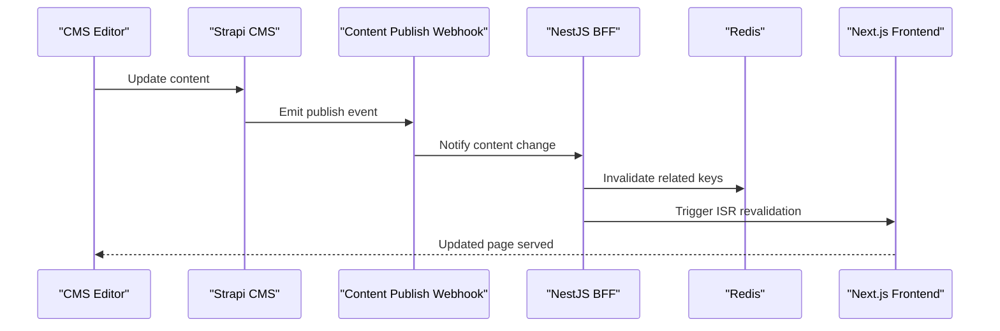
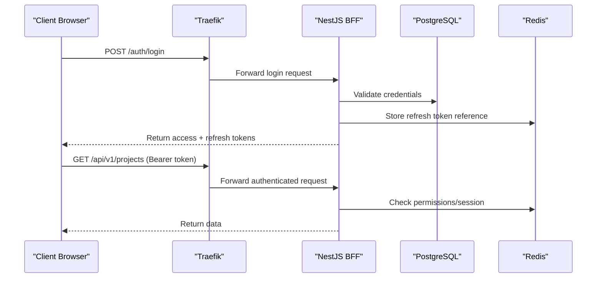
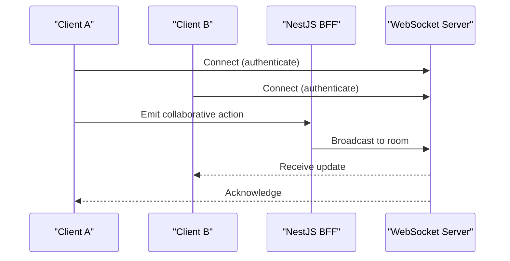
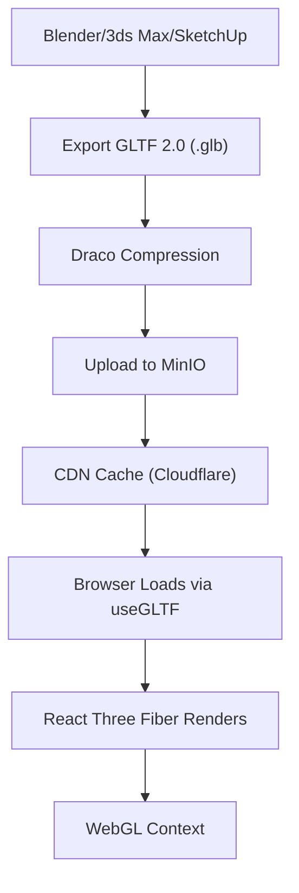
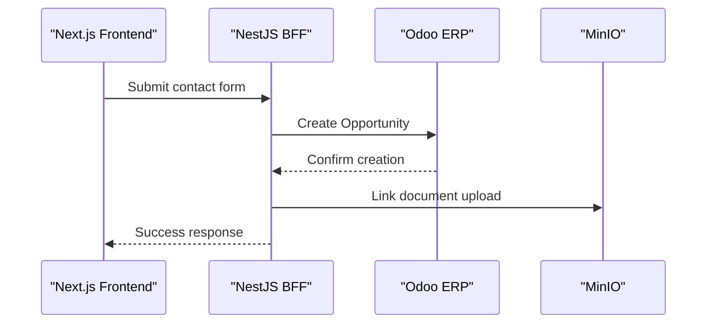
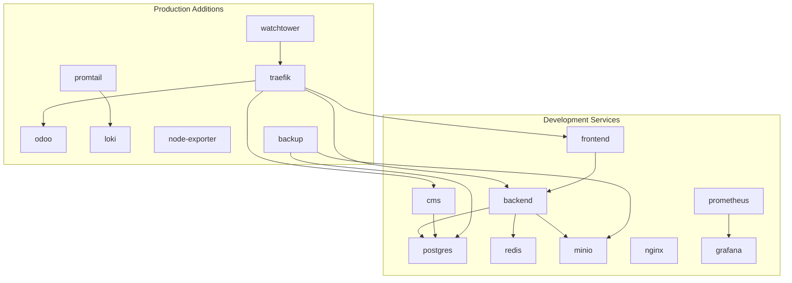

# System Architecture

<cite>
**Referenced Files in This Document**
- [HIGH_LEVEL_DESIGN.md](file://HEXA-Vision-Playbook/01-ARCHITECTURE/HIGH_LEVEL_DESIGN.md)
- [SYSTEM_ARCHITECTURE.md](file://HEXA-Vision-Playbook/01-ARCHITECTURE/SYSTEM_ARCHITECTURE.md)
- [DATA_FLOW.md](file://HEXA-Vision-Playbook/01-ARCHITECTURE/DATA_FLOW.md)
- [authentication-flow.md](file://HEXA-Vision-Playbook/01-ARCHITECTURE/authentication-flow.md)
- [3d-rendering-pipeline.md](file://HEXA-Vision-Playbook/01-ARCHITECTURE/3d-rendering-pipeline.md)
- [NETWORK_ARCHITECTURE.md](file://HEXA-Vision-Playbook/01-ARCHITECTURE/NETWORK_ARCHITECTURE.md)
- [docker-compose.yml](file://docker-compose.yml)
- [docker-compose.prod.yml](file://docker-compose.prod.yml)
- [main.ts](file://apps/backend/src/main.ts)
- [next.config.ts](file://apps/frontend/next.config.ts)
- [server.ts](file://apps/cms/config/server.ts)
</cite>

## Table of Contents
1. [Introduction](#introduction)
2. [Project Structure](#project-structure)
3. [Core Components](#core-components)
4. [Architecture Overview](#architecture-overview)
5. [Detailed Component Analysis](#detailed-component-analysis)
6. [Dependency Analysis](#dependency-analysis)
7. [Performance Considerations](#performance-considerations)
8. [Troubleshooting Guide](#troubleshooting-guide)
9. [Conclusion](#conclusion)
10. [Appendices](#appendices)

## Introduction
This document presents the system architecture for HexaStudio as a full-stack application following a microservices-oriented monorepo structure. It covers the high-level topology, component interactions across Next.js frontend, NestJS Backend-for-Frontend (BFF), Strapi CMS, and external integrations such as Odoo ERP. It also documents data flows from asset pipeline to 3D rendering, authentication with JWT tokens, real-time collaboration via WebSocket, infrastructure topology orchestrated by Docker Compose with 14 services, and key architectural patterns including BFF, event-driven communication, and container orchestration.

## Project Structure
HexaStudio is organized as a monorepo with separate applications:
- Frontend: Next.js application serving the user experience and 3D scenes.
- Backend: NestJS BFF aggregating content, handling auth, caching, and orchestrating integrations.
- CMS: Strapi headless CMS managing content and assets.
- Infrastructure: Docker Compose files defining development and production topologies with databases, cache, object storage, reverse proxy, monitoring, and optional Odoo ERP.

**Diagram sources**
- [docker-compose.yml:1-200](file://docker-compose.yml#L1-L200)
- [docker-compose.prod.yml:1-392](file://docker-compose.prod.yml#L1-L392)
- [NETWORK_ARCHITECTURE.md:1-35](file://HEXA-Vision-Playbook/01-ARCHITECTURE/NETWORK_ARCHITECTURE.md#L1-L35)

**Section sources**
- [HIGH_LEVEL_DESIGN.md:1-60](file://HEXA-Vision-Playbook/01-ARCHITECTURE/HIGH_LEVEL_DESIGN.md#L1-L60)
- [SYSTEM_ARCHITECTURE.md:1-70](file://HEXA-Vision-Playbook/01-ARCHITECTURE/SYSTEM_ARCHITECTURE.md#L1-L70)
- [docker-compose.yml:1-200](file://docker-compose.yml#L1-L200)
- [docker-compose.prod.yml:1-392](file://docker-compose.prod.yml#L1-L392)

## Core Components
- Presentation Layer (Next.js): Hybrid rendering for SEO-critical pages and client-side 3D canvas; uses React Three Fiber and Zustand for state; integrates with TanStack Query for server-state synchronization.
- Orchestration Layer (NestJS BFF): Aggregates and transforms content from Strapi into view models; handles JWT-based authentication and RBAC; caches responses using Redis; exposes REST API with Swagger documentation in development.
- Content Layer (Strapi CMS): Headless CMS providing content schemas, APIs, and webhooks; stores metadata and links to assets hosted in MinIO.
- Data & Infrastructure Layer: PostgreSQL for relational data; Redis for caching and sessions; MinIO for large 3D assets; Traefik for routing and TLS termination; Cloudflare for edge caching and WAF; Prometheus/Grafana/Loki for observability.

Key configuration highlights:
- NestJS bootstrap sets global prefix, validation, CORS, security headers, and optional Swagger docs.
- Next.js config enables standalone output, strict mode, package optimization, and image remote patterns for CDN and storage domains.
- Strapi server config binds host/port and controls webhook behavior.

**Section sources**
- [SYSTEM_ARCHITECTURE.md:1-70](file://HEXA-Vision-Playbook/01-ARCHITECTURE/SYSTEM_ARCHITECTURE.md#L1-L70)
- [main.ts:1-57](file://apps/backend/src/main.ts#L1-L57)
- [next.config.ts:1-44](file://apps/frontend/next.config.ts#L1-L44)
- [server.ts:1-11](file://apps/cms/config/server.ts#L1-L11)

## Architecture Overview
The HexaStudio architecture follows a decoupled hybrid design:
- Frontend renders static pages for SEO and interactive 3D experiences on the client.
- BFF acts as an aggregation and security layer, shielding the frontend from CMS schema changes and optimizing payloads.
- CMS manages content and triggers events (webhooks) to update caches and revalidate pages.
- External systems like Odoo ERP integrate via the BFF for business data synchronization.

**Diagram sources**
- [docker-compose.yml:1-200](file://docker-compose.yml#L1-L200)
- [docker-compose.prod.yml:1-392](file://docker-compose.prod.yml#L1-L392)
- [NETWORK_ARCHITECTURE.md:1-35](file://HEXA-Vision-Playbook/01-ARCHITECTURE/NETWORK_ARCHITECTURE.md#L1-L35)

## Detailed Component Analysis

### Next.js Frontend
- Responsibilities: Deliver UI, manage 3D scenes, handle client-side state, and coordinate asset loading.
- Rendering strategy: Static generation for SEO pages; client-side rendering for interactive 3D canvas.
- Asset delivery: Uses optimized loading strategies and CDN for heavy assets.
- Configuration: Standalone output, strict mode, package imports optimization, and image remote patterns for CDN and storage.

**Diagram sources**
- [next.config.ts:1-44](file://apps/frontend/next.config.ts#L1-L44)
- [3d-rendering-pipeline.md:1-154](file://HEXA-Vision-Playbook/01-ARCHITECTURE/3d-rendering-pipeline.md#L1-L154)

**Section sources**
- [SYSTEM_ARCHITECTURE.md:1-70](file://HEXA-Vision-Playbook/01-ARCHITECTURE/SYSTEM_ARCHITECTURE.md#L1-L70)
- [next.config.ts:1-44](file://apps/frontend/next.config.ts#L1-L44)

### NestJS BFF
- Responsibilities: Aggregate content from CMS, transform into view models, enforce auth/RBAC, cache responses, and integrate with external systems (Odoo).
- Security: Helmet headers, global validation, CORS configuration, and optional Swagger docs in development.
- Caching: Redis-backed caching for expensive endpoints and session data.
- Observability: Sentry integration for error tracking.

**Diagram sources**
- [main.ts:1-57](file://apps/backend/src/main.ts#L1-L57)
- [docker-compose.yml:55-83](file://docker-compose.yml#L55-L83)
- [docker-compose.prod.yml:125-164](file://docker-compose.prod.yml#L125-L164)

**Section sources**
- [main.ts:1-57](file://apps/backend/src/main.ts#L1-L57)
- [SYSTEM_ARCHITECTURE.md:1-70](file://HEXA-Vision-Playbook/01-ARCHITECTURE/SYSTEM_ARCHITECTURE.md#L1-L70)

### Strapi CMS
- Responsibilities: Manage content schemas, provide REST APIs, and trigger webhooks on content lifecycle events.
- Integration: Stores metadata and links to assets hosted in MinIO; webhooks notify BFF to invalidate caches and revalidate pages.
- Configuration: Host/port binding and webhook population settings.

**Diagram sources**
- [DATA_FLOW.md:1-124](file://HEXA-Vision-Playbook/01-ARCHITECTURE/DATA_FLOW.md#L1-L124)
- [server.ts:1-11](file://apps/cms/config/server.ts#L1-L11)

**Section sources**
- [DATA_FLOW.md:1-124](file://HEXA-Vision-Playbook/01-ARCHITECTURE/DATA_FLOW.md#L1-L124)
- [server.ts:1-11](file://apps/cms/config/server.ts#L1-L11)

### Authentication Flow (JWT)
- Login: Client sends credentials to BFF; BFF validates and issues access and refresh tokens.
- Access Token: Short TTL, included in Authorization header for subsequent requests.
- Refresh Token: Longer TTL, stored securely (HTTP-only cookie or memory); used to obtain new access tokens upon expiry.
- Guards: JWT guard verifies token validity; roles guard enforces RBAC.

**Diagram sources**
- [authentication-flow.md:1-123](file://HEXA-Vision-Playbook/01-ARCHITECTURE/authentication-flow.md#L1-L123)
- [docker-compose.yml:1-200](file://docker-compose.yml#L1-L200)
- [docker-compose.prod.yml:1-392](file://docker-compose.prod.yml#L1-L392)

**Section sources**
- [authentication-flow.md:1-123](file://HEXA-Vision-Playbook/01-ARCHITECTURE/authentication-flow.md#L1-L123)

### Real-Time Collaboration (WebSocket)
- Pattern: WebSocket channels enable real-time updates between clients and the backend.
- Use cases: Live collaboration in 3D scenes, presence indicators, and synchronized state updates.
- Integration: BFF manages WebSocket connections and broadcasts events to relevant clients.

[No diagram sources needed since this diagram shows conceptual workflow, not actual code structure]

### 3D Rendering Pipeline
- Asset preparation: Export GLTF 2.0 (.glb), apply transforms, triangulate faces, include meshes/materials/textures, exclude cameras/lights/animations.
- Optimization: Draco compression reduces geometry size; target file sizes under thresholds.
- Delivery: Upload to MinIO; serve via CDN; client loads via useGLTF and renders through React Three Fiber.
- Performance budgets: Targets for draw calls, triangles, textures, materials, FPS, and load time.

**Diagram sources**
- [3d-rendering-pipeline.md:1-154](file://HEXA-Vision-Playbook/01-ARCHITECTURE/3d-rendering-pipeline.md#L1-L154)

**Section sources**
- [3d-rendering-pipeline.md:1-154](file://HEXA-Vision-Playbook/01-ARCHITECTURE/3d-rendering-pipeline.md#L1-L154)

### Odoo ERP Integration
- Business data synchronization: Contact forms create CRM opportunities; projects sync milestones; documents link to MinIO.
- Integration points: BFF calls Odoo APIs to push/pull data; webhooks can trigger updates in both directions.

**Diagram sources**
- [DATA_FLOW.md:57-73](file://HEXA-Vision-Playbook/01-ARCHITECTURE/DATA_FLOW.md#L57-L73)
- [docker-compose.prod.yml:222-253](file://docker-compose.prod.yml#L222-L253)

**Section sources**
- [DATA_FLOW.md:57-73](file://HEXA-Vision-Playbook/01-ARCHITECTURE/DATA_FLOW.md#L57-L73)

## Dependency Analysis
Infrastructure dependencies are defined in Docker Compose files:
- Development compose includes Postgres, Redis, MinIO, Backend, CMS, Frontend, Nginx, Prometheus, Grafana.
- Production compose adds Traefik, Odoo, Loki, Promtail, Node Exporter, Watchtower, Backup service.

**Diagram sources**
- [docker-compose.yml:1-200](file://docker-compose.yml#L1-L200)
- [docker-compose.prod.yml:1-392](file://docker-compose.prod.yml#L1-L392)

**Section sources**
- [docker-compose.yml:1-200](file://docker-compose.yml#L1-L200)
- [docker-compose.prod.yml:1-392](file://docker-compose.prod.yml#L1-L392)

## Performance Considerations
- Caching Strategy: Multi-layered caching across browser, CDN, Redis, and client-side query cache.
- Asset Optimization: Draco compression, LOD management, and minimal post-processing for 3D scenes.
- Horizontal Scaling: Stateless backend allows multiple instances behind Traefik; CDN offloads static assets.
- Graceful Degradation: Fallback to static gallery if 3D engine fails to initialize.

[No sources needed since this section provides general guidance]

## Troubleshooting Guide
- Error Handling: Global exception filter formats structured errors; Sentry captures server errors; rate limiting and guards return appropriate HTTP status codes.
- Health Checks: Services expose health endpoints; Docker Compose defines health checks for dependency readiness.
- Logging: Structured JSON logs sent to console; Loki/Promtail collect logs for centralized analysis.

**Section sources**
- [DATA_FLOW.md:101-124](file://HEXA-Vision-Playbook/01-ARCHITECTURE/DATA_FLOW.md#L101-L124)
- [docker-compose.yml:1-200](file://docker-compose.yml#L1-L200)
- [docker-compose.prod.yml:1-392](file://docker-compose.prod.yml#L1-L392)

## Conclusion
HexaStudio’s architecture combines a modern full-stack approach with clear separation of concerns: Next.js for rich user experiences, NestJS BFF for secure orchestration, Strapi for content management, and robust infrastructure via Docker Compose. The design supports scalability, resilience, and performance through caching, CDN, and optimized 3D pipelines. Event-driven communication and real-time collaboration enhance interactivity, while comprehensive observability ensures operational reliability.

## Appendices
- Subdomain registry and routing logic define how traffic is directed to services via Traefik and protected by Cloudflare.
- Technology stack decisions emphasize loose coupling, end-to-end typing, hybrid rendering, and S3-compatible storage for massive asset scaling.

**Section sources**
- [NETWORK_ARCHITECTURE.md:1-35](file://HEXA-Vision-Playbook/01-ARCHITECTURE/NETWORK_ARCHITECTURE.md#L1-L35)
- [HIGH_LEVEL_DESIGN.md:43-60](file://HEXA-Vision-Playbook/01-ARCHITECTURE/HIGH_LEVEL_DESIGN.md#L43-L60)