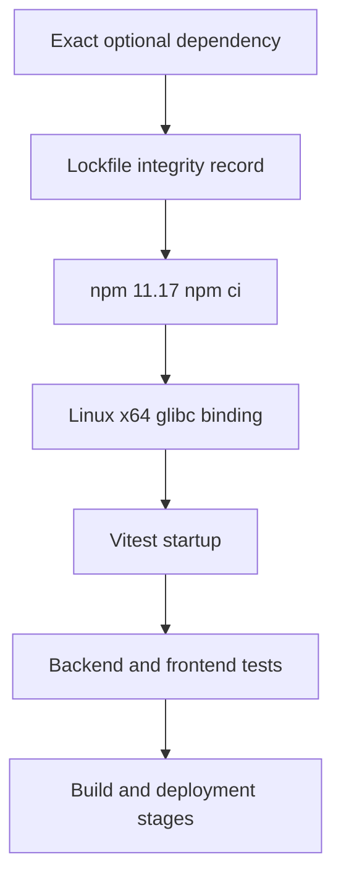

# ADR-010: Pin the CI Node/npm Toolchain and Govern Native Optional Dependencies

**Status:** Accepted for implementation; production validation pending  
**Date:** 2026-07-27  
**Deciders:** Architecture Review Board, DevOps Lead, QA Lead  
**Scope:** GitLab CI and root npm workspace

## Context

GitLab Pipeline #8 failed before executing backend tests. The repository lockfile was generated on Windows and contained the Windows Rolldown binding record but omitted the Linux x64 glibc package record. GitLab used Node 20 with bundled npm 10.8.2. `npm ci` and a subsequent `npm rebuild` did not add the missing package, and Vitest failed to load `@rolldown/binding-linux-x64-gnu`.

The same pipeline would next have attempted `npm run test --workspace=packages/ui`, although that workspace has no test script.

## Decision

1. Pin CI to `node:20.20.2-bookworm-slim`.
2. Install and report npm `11.17.0`, matching the root `packageManager` declaration.
3. Add `@rolldown/binding-linux-x64-gnu@1.1.5` as an exact root optional dependency.
4. Regenerate the npm lockfile so the Linux binding has version, platform, libc, and integrity metadata.
5. Remove `npm rebuild`; it cannot install a package omitted from the lockfile.
6. Remove the nonexistent `packages/ui` test invocation rather than silently skipping it.
7. Validate in a clean Debian/glibc container and then in the live GitLab pipeline.

## Architecture

## Business Impact

- Restores trustworthy CI feedback and unblocks GitLab go-live.
- Prevents platform-dependent lockfile corruption from stopping releases.
- Reduces wasted single-runner time by failing only on real quality defects.

## Technical Impact

- Adds one exact native optional dependency to the root workspace.
- Standardizes CI on an explicit Node/npm pair.
- Does not change application runtime behavior or user-facing bundles; Vitest/Rolldown are development tooling.

## Security Assessment

- Native executable code increases supply-chain sensitivity.
- Mitigations: exact version, lockfile integrity, SBOM/security scans, target-platform load test, and synchronized upgrades with Rolldown.
- Repeated public-registry npm installation should be replaced by a pinned internal CI image.
- Plain-HTTP GitLab access and exposed credentials are tracked separately as P0 risk.

## Performance Assessment

- Removing `npm rebuild` eliminates duplicate lifecycle-script execution.
- Installing npm globally adds setup time per Node job.
- The current single runner and cache strategy remain performance debt but do not block correctness.

## Accessibility Assessment

No user interface, content, semantics, focus behavior, or motion behavior changes. Accessibility impact is N/A for implementation; existing E2E accessibility checks remain part of the full pipeline.

## Alternatives Considered

- **Ad-hoc CI install:** rejected because CI would differ from the committed graph.
- **npm 10 plus rebuild:** rejected because Pipeline #8 proved it ineffective.
- **Complete Linux lockfile regeneration:** rejected because it creates a large unrelated dependency diff.
- **Skip tests:** rejected because it hides a real failure.

## Migration Plan

1. Commit manifest, lockfile, and CI changes atomically.
2. Run YAML validation and clean Linux install/binding/tests.
3. Run lint, typecheck, and build gates.
4. Push to GitLab and observe the replacement pipeline.

## Rollback Plan

Revert the atomic commit. No data migration or production runtime rollback is required. If the Node image is unavailable, use a verified digest-compatible Node 20.20.x Debian image while retaining npm 11.17.0 and the exact binding lock record.

## Consequences

### Positive

- Deterministic Linux Vitest startup.
- Toolchain matches repository declaration.
- Narrow and auditable dependency change.
- No silent test bypass.

### Negative

- Linux x64 glibc is explicit; musl or ARM runners require separately governed bindings.
- Repeated npm installation costs CI time until a maintained CI image exists.
- The UI workspace still lacks tests.

## Validation Evidence

| Gate | Result |
|------|--------|
| YAML semantic validation | Passed locally: 17 jobs, 5 stages |
| Narrow dependency diff | Passed: exact manifest entry + 23 lockfile lines |
| Clean Linux install/binding load | Pending |
| Backend tests on Linux | Pending |
| Frontend tests on Linux | Pending |
| Full GitLab pipeline | Pending |
