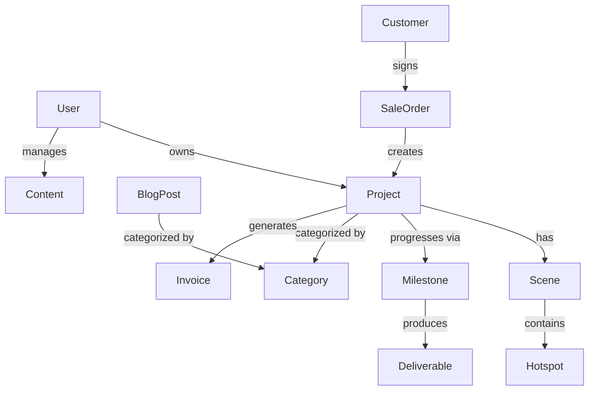

# Domain Model

**Last Updated:** 2026-07-08

---

## Core Entities

The platform is modeled around four primary domains: **User**, **Project**, **Content**, and **Business**.

### 1. User Domain
Manages identities and access.

- **User:** The root identity.
- **Role:** Defines permissions (public, client, admin, etc.).
- **Profile:** User-specific metadata (name, avatar, etc.).
- **Session:** Temporary authentication state.

### 2. Project Domain
Manages the 3D architectural deliverables.

- **Project:** The main entity representing an architectural work.
- **Scene:** A specific 3D view or environment within a project.
- **Hotspot:** An interactive point within a scene.
- **Milestone:** A key deliverable in the project timeline.
- **Deliverable:** A specific file (render, model, PDF) associated with a milestone.

### 3. Content Domain
Manages the marketing and educational content.

- **Page:** A structured web page (landing, about, etc.).
- **Blog Post:** A time-dated educational or news article.
- **Service:** A definition of a service offered by the studio.
- **Category:** A tag for grouping projects or blog posts.
- **Media:** Images, videos, or 3D models used across the site.

### 4. Business Domain (Odoo)
Manages the operational aspects.

- **Lead/Opportunity:** A potential client or project.
- **Customer:** A converted lead with a contract.
- **Contract/Sale Order:** The legal agreement and pricing.
- **Task:** A specific work item within a project.
- **Invoice:** A request for payment.

## Entity Relationships

## Data Consistency

- **Source of Truth:**
  - User data → PostgreSQL (Application DB)
  - Project Content → Strapi CMS
  - Business Data → Odoo ERP
  - Files → MinIO
- **Synchronization:**
  - Odoo → Website (async, 30s latency)
  - Strapi → Website (ISR, event-driven)
