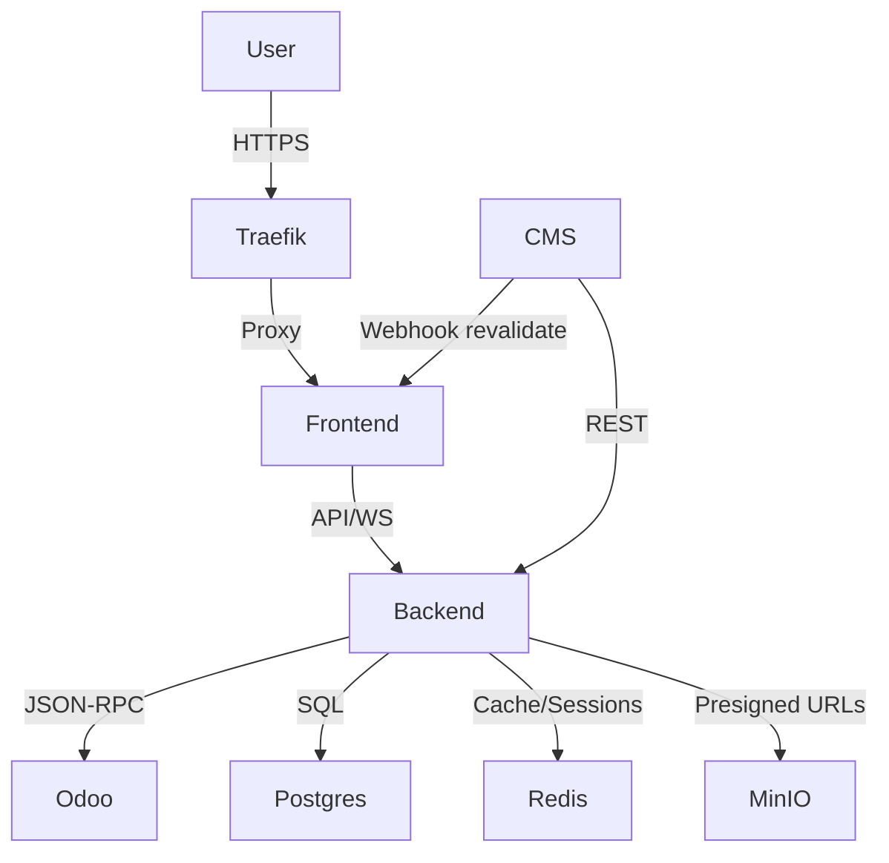

# Current Architecture Overview — HEXA STUDIO

> Verified 2026-08-02. Companion to `docs/architecture/SYSTEM_ARCHITECTURE.md`; this is the PHASE 0 discovery snapshot.

## System Components

1. **Frontend — `apps/frontend` (Next.js 16.2.11 / React 19)**
   - User-facing studio application (App Router, SSR/RSC).
   - Three.js / React Three Fiber for 3D visualization, gated by `useMotionPolicy`, lazily loaded, static-card fallback.
   - Sentry (error tracking), OpenTelemetry (observability), Web Vitals instrumentation.
   - State: Zustand (client) + TanStack Query (server) per ADR-006.

2. **Backend — `apps/backend` (NestJS 11)**
   - REST API (Swagger) + Socket.io realtime; JWT auth via Passport; RBAC.
   - Modules: agents (AI persona chat + Redis memory), auth, integrations, etc.
   - Odoo JSON-RPC client (`OdooApiService`) for CRM leads & billing sync.
   - Observability: Prometheus / OpenTelemetry; validation via class-validator; security via helmet.

3. **CMS — `apps/cms` (Strapi 5, headless)**
   - Content modeling; webhook triggers to Next.js revalidation.

4. **ERP — Odoo 17.0 (custom module `hexa_studio`)**
   - Source of truth for projects, milestones, webhook management; exposes JSON-RPC.

5. **Mobile — `apps/mobile` (Expo)**
   - React Native app mirroring core functionality (typecheck currently failing — see PROJECT_STATUS).

## Data Flow

## Infrastructure

- **Ingress:** Traefik v3 (+ Cloudflared tunnel); Nginx not used.
- **Data:** PostgreSQL 16 (internal network), Redis 7 (cache/session/memory), MinIO (assets/deliverables).
- **CI/CD:** GitLab CE; docker-compose orchestration; protected branches.
- **Edge:** Cloudflare CDN/WAF.

## Architectural Principles (see GOVERNANCE.md)

- Monorepo workspaces: `apps/{frontend,backend,mobile,cms}` + `packages/{types,ui,utils}`.
- Strict TypeScript (0 `any`); shared types via `@hexastudio/types`.
- Zero-trust service communication inside the Docker network.
- ADR-based decision process; docs in `docs/<area>/` (ADR-011).

## References
- `docs/architecture/SYSTEM_ARCHITECTURE.md`, `docs/architecture/HIGH_LEVEL_DESIGN.md`, `docs/architecture/SERVICE_CATALOG.md`, `docs/architecture/DATA_FLOW.md`, `docs/adr/README.md`
