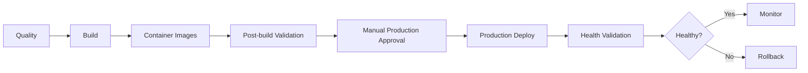

# HEXA Studio — CI/CD Governance

**Version:** 1.0  
**Last Updated:** 2026-07-27  
**Owner:** DevOps Lead  
**Authority:** Enterprise Architecture Governance v2.0

## 1. Purpose

This document governs the GitLab pipeline in `/.gitlab-ci.yml`. YAML validation alone is not deployment evidence. A pipeline is validated only after live GitLab execution reaches every required stage successfully or records an approved, documented exception.

> **Non-canonical variant:** `.gitlab-ci-optimized.yml` is an **experimental alternative** to the canonical pipeline and is **not** the source of truth. It is intentionally retained for evaluation only. Key differences from `.gitlab-ci.yml`: a different stage set/ordering (`validate → quality → build → image → test → deploy`) and **no `mobile` stage** (the canonical pipeline runs `quality → build → image → validate → mobile → deploy`). The local validator `scripts/validate-gitlab-ci.js` validates only `.gitlab-ci.yml`; the optimized variant is excluded by design.

## 2. Pipeline Control Flow

## 3. Required Controls

| Control | Implementation | Blocking policy |
|---------|----------------|-----------------|
| Formatting/lint | ESLint jobs | Errors or warnings configured as errors block |
| Static analysis/typecheck | TypeScript workspace checks | Any error blocks |
| Unit/integration tests | Vitest workspace jobs | Any failure blocks |
| Dependency scan | npm audit/Snyk | P0/P1 findings require owner and due date |
| SBOM | CycloneDX | Missing artifact blocks release readiness |
| Build | Shared packages, frontend, backend | Any failure blocks image stage |
| Container build | Docker Buildx | Any failure blocks validation |
| Container security | Trivy | Fixable CRITICAL findings block |
| E2E/visual/Lighthouse | Playwright and LHCI | Branch policy determines blocking behavior |
| Image signing | Not yet implemented | Required before external distribution |
| Production approval | Manual protected action | Maintainer approval required |
| Health validation | Container and HTTP checks | Failure triggers rollback |

## 4. Toolchain Baseline

| Tool | Governed version | Rationale |
|------|--------------------|-----------|
| Node.js | `20.20.2-bookworm-slim` | Stable glibc Linux baseline; satisfies Vite/Rolldown engines |
| npm | `11.17.0` | Matches root `packageManager`; avoids npm 10 optional-dependency lock behavior |
| Lockfile | npm lockfile v3 | Deterministic workspace installs |
| Runner | GitLab Docker executor | Isolated Linux jobs |

All jobs that invoke npm must report Node/npm versions and use `npm ci --legacy-peer-deps`. Toolchain changes require an ADR and Linux verification.

## 5. Native Dependency Policy

Platform-specific native packages must be exact-version pinned to their JavaScript wrapper, optional where other host platforms may not support them, integrity-locked, loaded in a clean target-platform container before merge, and reviewed whenever the parent package changes.

The current decision is documented in `architecture/ARCHITECTURE_DECISIONS/ADR-010-ci-node-toolchain-and-native-dependencies.md`.

## 6. Deployment and Rollback

### Migration

- Commit manifest, lockfile, and pipeline changes atomically.
- Validate YAML structure and clean Linux install/tests.
- Push and observe the complete GitLab pipeline.

### Rollback

- Revert the atomic CI commit.
- Never bypass failed tests with `allow_failure`, `--if-present`, or shell success coercion.
- Production deployment remains manual until all required upstream jobs pass.

## 7. Evidence Register

| Date | Pipeline | Result | Evidence | Release status |
|------|----------|--------|----------|----------------|
| 2026-07-25 | #8, commit `c017528` | Failed | Quality jobs passed except test; backend Vitest could not load `@rolldown/binding-linux-x64-gnu` | BLOCKED |
| 2026-07-27 | Replacement pipeline | Pending | ADR-010 remediation under validation | BLOCKED until green |

## 8. Known Governance Gaps

| ID | Gap | Priority | Owner | Target |
|----|-----|----------|-------|--------|
| CI-GAP-001 | Single runner serializes jobs and slows feedback | P1 | DevOps | S-019 |
| CI-GAP-002 | Image signing/attestation is not implemented | P1 | Security/DevOps | S-019 |
| CI-GAP-003 | `node_modules` cache is platform-specific and inefficient with `npm ci` | P1 | DevOps | S-019 |
| CI-GAP-004 | JUnit paths exist without configured Vitest JUnit reporters | P2 | QA | S-019 |
| CI-GAP-005 | `packages/ui` has no test suite; CI must not claim one | P2 | Frontend/QA | S-019 |
| CI-GAP-006 | GitLab currently uses plain HTTP and must move behind TLS | P0 | DevOps/Security | Before production trust |

## 9. Review Cadence

- Per pipeline change: ADR impact, YAML validation, clean Linux test.
- Weekly: runner health, queue time, cache hit rate, failed-job trends.
- Monthly: dependency/SBOM review, image retention, pipeline permissions.
- Quarterly: runner and base-image upgrades, rollback drill, governance audit.
