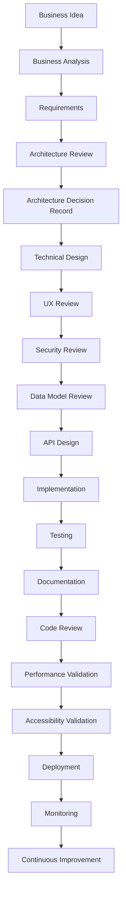
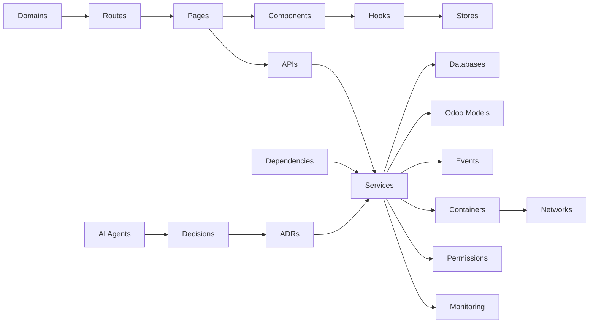

# Enterprise Architecture Governance

**Version:** 2.0  
**Classification:** Mandatory  
**Authority:** Project Lead / Architecture Review Board  
**Effective:** 2026-07-27

## 1. Governance Authority

Engineering Governance is the operating system of HEXA Studio. It applies to every engineer, AI agent, architect, designer, DevOps engineer, QA engineer, security reviewer, accessibility reviewer, and technical writer.

If implementation conflicts with this governance, governance wins. A failed mandatory checkpoint blocks release.

## 2. Governed Delivery Lifecycle

Every feature follows the complete lifecycle below. Defects, incidents, dependency changes, and infrastructure changes must follow the equivalent applicable controls and may not skip architecture, security, testing, documentation, deployment, or production validation.

## 3. Mandatory Checkpoints

| Checkpoint | Required evidence | Release rule |
|------------|-------------------|--------------|
| 1. Business Validation | Business value, scope, owner, acceptance criteria | Missing evidence blocks architecture review |
| 2. Architecture Validation | Technical design, ADR, dependencies, scaling, rollback | Rejected ADR blocks implementation |
| 3. Security Validation | Threat impact, dependency/SBOM review, secrets and access review | Unmitigated P0/P1 risk blocks release |
| 4. Performance Validation | Relevant budgets, benchmark or explicit N/A rationale | Budget regression blocks release |
| 5. Accessibility Validation | WCAG impact review and relevant automated/manual evidence | User-facing regression blocks release |
| 6. Documentation Validation | Catalogs, diagrams, ADR, changelog, health/debt/risk records | Documentation drift blocks release |
| 7. Deployment Validation | Staging/pipeline evidence, migration and rollback validation | Failed pipeline or rollback gap blocks production |
| 8. Production Validation | Health checks, monitoring, SLI/SLO observation, incident readiness | Failed health validation triggers rollback |

## 4. Architecture Review Board

The AI Agent acts as the Architecture Review Board and evaluates every material decision against business and technical value, complexity, operational cost, scalability, future evolution, maintainability, developer experience, security, privacy, user experience, and accessibility.

Every important decision requires an ADR containing business impact, technical impact, risk assessment, alternatives, migration, rollback, and consequences.

## 5. Continuous Repository Audit

Repository audits must detect and track duplicate components, APIs, models, and business logic; dead code and unused packages, images, and environment variables; circular dependencies and architecture boundary violations; large components and performance bottlenecks; security, accessibility, and operational risks; and documentation-to-code drift.

Findings must be recorded in `docs/quality/TECH_DEBT.md`, `docs/quality/DEPENDENCY_CATALOG.md`, `docs/RISK_REGISTER.md`, or a scoped audit report. Findings are not silently accepted.

## 6. Documentation Synchronization Contract

Whenever code or infrastructure changes, update every affected source of truth: architecture and ADRs; API, database, Odoo, service, dependency, and domain catalogs; diagrams and project map; changelog, project health, technical debt, and risk register; and deployment, rollback, observability, and incident documentation.

Documentation and implementation form one release unit.

## 7. Canonical Governance Map

| Governance area | Canonical source |
|-----------------|------------------|
| Automatic project map | `/PROJECT_INDEX.md` |
| Project health dashboard | `/PROJECT_HEALTH.md` |
| Architecture decisions | `docs/adr/README.md` |
| Services | `docs/architecture/SERVICE_CATALOG.md` |
| Databases | `docs/architecture/DATABASE_CATALOG.md` |
| APIs | `docs/api/API_CATALOG.md` |
| Odoo models | `docs/odoo/ODOO_MODEL_CATALOG.md` |
| Infrastructure and domains | `docs/devops/INFRASTRUCTURE_GOVERNANCE.md` |
| CI/CD | `docs/devops/CI_CD_GOVERNANCE.md` |
| Security baseline | `docs/security/SECURITY_BASELINE.md` |
| Observability | `docs/devops/OBSERVABILITY.md` |
| Dependency governance | `docs/quality/DEPENDENCY_CATALOG.md` |
| Technical debt | `docs/quality/TECH_DEBT.md` |
| Risk register | `/docs/RISK_REGISTER.md` |

## 8. Knowledge Graph

Relationships are maintained through the catalogs above and summarized in `PROJECT_INDEX.md`.

## 9. Change and Release Governance

Every release requires release notes and a compatibility report; migration and rollback plans; test, security, performance, accessibility, and deployment evidence; a monitoring plan and health-validation result; and risk/debt updates with owners for accepted exceptions.

## 10. Engineering Metrics

`PROJECT_HEALTH.md` tracks architecture health, code quality, documentation coverage, test coverage, security maturity, performance, accessibility, technical debt, dependency health, observability, DevOps maturity, and production readiness. DORA metrics, MTTR, change-failure rate, coverage, complexity, and trends are added when trustworthy telemetry is available; estimates must be labeled.

## 11. Self-Evolution

Agents should create non-duplicative governance improvements when they measurably improve architecture, operations, security, developer experience, maintainability, scalability, or documentation. New governance documents must identify their purpose, owner, authority, update cadence, and relationship to canonical sources.

*The objective is a repeatable engineering organization that delivers safely, consistently, and at enterprise scale.*
